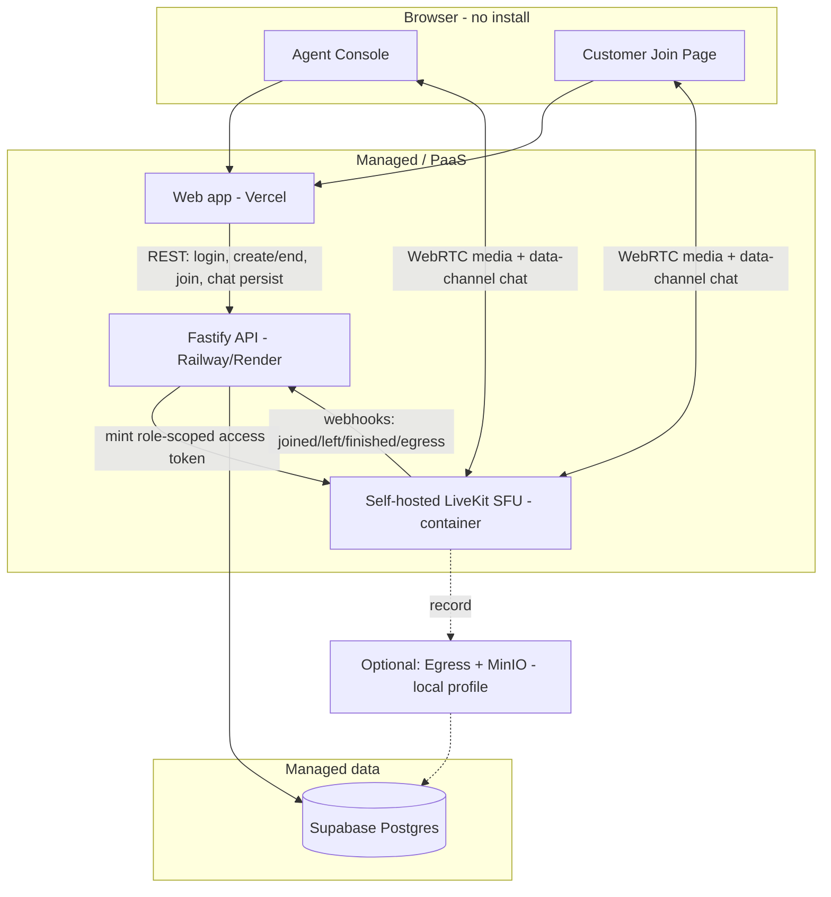

# AssistLens — Real-Time Visual Customer Support Platform

> "Helping support teams see what customers see."

Owned, private, recordable, reviewable visual support — with **no third-party hosted video API** and **no app install**. A support agent creates a session, shares a link, and a customer is on video from a phone browser in seconds.

Built for the AtomQuest Hackathon "Real-Time Video Support Platform" problem statement.

---

## What it does

- **Agent** signs in, creates a session, and gets a shareable invite link. They run the call, mute/unmute, toggle video, start/stop recording, and end the session. They can review full session history afterwards.
- **Customer** clicks the SMS/email link, lands on one screen, taps **Allow**, and is on video. No account, no app, mobile-first.
- Media is routed by a **self-hosted LiveKit SFU** (Selective Forwarding Unit) — every stream goes through a server we own and operate. **No peer-to-peer, no hosted video SDK.**

## Architecture



### Why these choices

| Concern | Choice | Why |
| --- | --- | --- |
| Media routing | **Self-hosted LiveKit SFU** | Server-routed (not P2P), runs on infrastructure we own/operate — satisfies the explicit ban on third-party hosted video APIs. LiveKit Cloud is intentionally NOT used for this reason. |
| Durable record | **Supabase Postgres** | Managed Postgres (a database, not a video API — fully allowed). Sessions, participants, events, chat, recordings are persisted and queryable. |
| Realtime chat | **LiveKit data channels** | Chat rides the same media connection (low latency, no extra infra), and each message is also persisted via REST for the session record. |
| Presence + reconnect grace | **Postgres** | `participants.left_at` = presence; `participants.grace_until` = the reconnect grace timer; a 5s sweep finalizes expired windows. No Redis needed. |
| Access control | **Signed invite tokens + JWT** | The invite token is the customer access-control primitive; agent JWT gates agent-only actions; LiveKit grants enforce roles at the media layer. |
| Observability | **Prometheus** | `/api/metrics` exposes active sessions, connected participants, error counts; LiveKit exposes its own metrics. |

A printable diagram lives at [`docs/architecture.md`](docs/architecture.md).

## Repo layout

```
api/    Fastify + TypeScript backend (auth, sessions, join, chat, webhooks, metrics)
web/    React + TypeScript + Vite + Tailwind frontend (agent console + customer join)
infra/  LiveKit configs (dev / recording / prod), Render blueprint, Prometheus config
docker-compose.yml            local LiveKit SFU
docker-compose.recording.yml  optional recording stack (Redis + MinIO + Egress)
```

## Roles & access control

- **Agent**: seeded account → email/password login → app JWT (12h). Required for create/end session, start/stop recording, and reading session history.
- **Customer**: no account. A **scoped, expiring signed invite token** (embeds `session_id`, `role=customer`, `exp`) is the only credential. The API validates it and mints a LiveKit access token with **customer grants** (publish/subscribe only — cannot manage or close the room). Agents get **room-admin** grants.
- Result: a customer literally cannot perform agent actions, and joining always requires a valid invite — one mechanism, not two bolted-on checks.

## Reliability — the named edge cases

- **Duplicate joins** — detected via an open participant row for the same identity; surfaced to the user ("already in this call on another tab") and logged as a `duplicate_join` event.
- **Invalid / expired invite** — the API rejects the token and the customer sees a friendly, human-readable page (not a stack trace).
- **Unexpected disconnect** — on `participant_left`, `grace_until` opens a reconnect window; rejoining within it re-opens the same row (others are never notified); when it elapses, a sweep records an authoritative `left` event.

## Bonus features implemented

- **Reconnect handling** (Postgres grace window + LiveKit native resume).
- **Observability** (`/api/metrics` Prometheus endpoint + LiveKit metrics; scrape config in [`infra/prometheus.yml`](infra/prometheus.yml)).
- **Recording** (optional) — LiveKit Egress records the room composite to MinIO (self-hosted S3); status surfaces as `in_progress → processing → ready` with a download link, and the customer sees a clear "this call is being recorded" consent banner.

---

## Run it locally

Prereqs: Node 20+, Docker (for LiveKit), and a free Supabase project.

### 1. Database (Supabase)

1. Create a project at supabase.com.
2. Copy **Project Settings → Database → Connection string (URI)**.
3. The schema auto-migrates on API boot (`api/src/migrations.sql`); the seed agent is created from `AGENT_EMAIL` / `AGENT_PASSWORD`.

### 2. LiveKit SFU

```bash
cp .env.example .env        # set LIVEKIT_API_KEY/SECRET (defaults are fine locally)
docker compose up           # starts LiveKit on ws://localhost:7880
```

### 3. API

```bash
cd api
cp .env.example .env        # set DATABASE_URL to your Supabase URI
npm install
npm run dev                 # http://localhost:8080  (auto-migrates + seeds agent)
```

### 4. Web

```bash
cd web
npm install
npm run dev                 # http://localhost:5173  (proxies /api → :8080)
```

Open http://localhost:5173, sign in as the agent, create a session, copy the invite link, and open it in a second browser/phone to join as the customer.

### Optional: recording

```bash
# instead of `docker compose up`
docker compose -f docker-compose.recording.yml up
```
Then set the API's `S3_*` / `MINIO_BUCKET` to the values in `.env`, and use the Record button in the agent call.

---

## Deploy (live URL)

- **Web → Vercel**: import `web/`, framework Vite. Set `VITE_API_BASE` to your API's public URL (e.g. `https://<api-host>/api`). `web/vercel.json` handles SPA routing.
- **API → Railway or Render**: deploy `api/` via its `Dockerfile`. Render users can apply [`infra/render.yaml`](infra/render.yaml). Set all secrets + `DATABASE_URL` (Supabase) + `PUBLIC_WEB_ORIGIN` (the Vercel URL) + `LIVEKIT_URL` / `PUBLIC_LIVEKIT_URL`.
- **LiveKit → self-hosted container** (Railway / Render / Fly): run the `livekit/livekit-server` image with [`infra/livekit.prod.yaml`](infra/livekit.prod.yaml) (replace the webhook URL with your API host; set `LIVEKIT_KEYS`). Expose 7880 (wss via the platform's TLS) plus the RTC/TURN ports. `PUBLIC_LIVEKIT_URL` must be the public `wss://` URL.

> HTTPS is required for `getUserMedia` and `wss` for LiveKit — Vercel/Railway/Render provide TLS automatically, which is why Caddy was dropped from the original design.

## Judging quick-start

- **Agent login**: `AGENT_EMAIL` / `AGENT_PASSWORD` (default `agent@assistlens.dev` / `demo-agent-pass`).
- **Switch roles**: sign in as agent → create session → copy invite link → open it in an incognito window / phone to act as the customer.

## Demo script (end-to-end, ~90s)

1. Agent signs in → **Create session** → copy invite link.
2. Agent **Join call** (waiting room).
3. Open invite on a phone → friendly screen → **Join video call** → Allow → both see/hear each other.
4. Exchange a **chat** message both ways.
5. Agent **Record** → customer's recording banner appears.
6. Reliability: open the invite a second time (**duplicate join** warning); open a tampered/expired link (**friendly error**); kill the customer's network briefly and restore (**reconnect** within grace, no re-join churn).
7. Agent **End** → customer sees the call ended → agent reviews **Details** (participants, durations, chat transcript, event log, recording download).

## Known limitations

- **Self-hosted LiveKit on a PaaS**: some hosts expose limited UDP; the config falls back to ICE-over-TCP + embedded TURN, which works but can reduce media quality on hostile networks.
- **Recording** requires the Redis + MinIO + Egress stack (the `docker-compose.recording.yml` profile); it is off in the lightweight managed deploy.
- **Single seeded agent** by default; multi-agent management and a full admin dashboard are out of scope for the sprint.
- A **screen-recorded demo** is kept as a safety net in case live infra misbehaves during judging.
- Confirm with organizers (in writing) that a self-hosted OSS SFU satisfies "owned and operated entirely by you" — the wording supports it.
