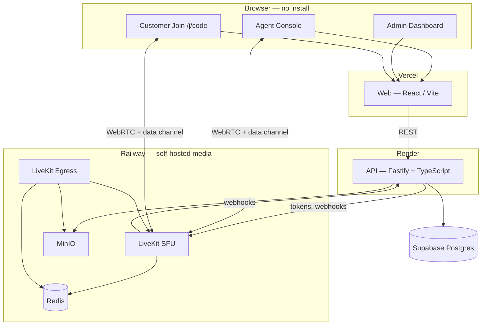

# AssistLens

**Real-time visual customer support — no app install, no third-party video API.**

AssistLens lets support agents start a video session in seconds, share a short link with a customer, and troubleshoot issues with live audio/video, in-call chat, file sharing, and optional recording. Media is routed through a **self-hosted LiveKit SFU** (server-side forwarding, not peer-to-peer).

Built for the AtomQuest Hackathon *Real-Time Video Support Platform* problem statement.

---

## Table of contents

- [Features](#features)
- [Architecture](#architecture)
- [Tech stack](#tech-stack)
- [Repository layout](#repository-layout)
- [Roles & access control](#roles--access-control)
- [Local development](#local-development)
- [Testing](#testing)
- [Environment variables](#environment-variables)
- [Deployment](#deployment)
- [API overview](#api-overview)

---

## Features

### Core (required)

| Feature | Description |
| --- | --- |
| **Agent session management** | Create, join, end, and review support sessions |
| **Customer join via link** | No account or app — open link, preview camera/mic, join |
| **Server-routed media** | Self-hosted LiveKit SFU; no P2P, no hosted video SDK |
| **Audio & video** | Full duplex A/V with mute/camera controls |
| **In-call chat** | Real-time chat over LiveKit data channels + Postgres persistence |
| **Role-based access** | Signed invite tokens for customers; JWT for agents/admins |

### Bonus

| Feature | Description |
| --- | --- |
| **Recording** | LiveKit Egress → MinIO; status flow `in_progress → processing → ready`; download via API |
| **File sharing in chat** | Upload images, PDFs, Office docs (≤20 MB) to MinIO; download from session record |
| **Reconnect handling** | 30s grace window in Postgres; seamless rejoin without notifying others |
| **Admin dashboard** | Separate login; view all sessions, participants, event logs; end any active session |
| **Observability** | Prometheus metrics at `/api/metrics`; health check at `/api/health` |
| **Pre-join lobby** | Google Meet–style camera/mic preview and device selection before entering the call |
| **Short invite URLs** | Share links like `/j/xk9m2pqa` instead of long JWT query strings |
| **Dark / light mode** | Theme toggle across agent, admin, and customer UIs |

---

## Architecture



### Design decisions

| Concern | Choice | Why |
| --- | --- | --- |
| Frontend | **Vercel** | Static SPA with HTTPS; proxies API via `VITE_API_BASE` |
| API | **Render** | Fastify service; handles auth, sessions, webhooks, admin |
| Media | Self-hosted **LiveKit SFU** on Railway | Server-routed media; no third-party hosted video API |
| Database | **Supabase Postgres** | Sessions, chat, events, recordings metadata |
| Realtime chat | **LiveKit data channels** + REST persist | Low latency in-call; durable transcript after the call |
| Presence / reconnect | **Postgres** (`grace_until` + sweep) | Reconnect grace without extra client state |
| Object storage | **MinIO** on Railway | Recordings and chat file attachments |
| Customer access | **Short invite code** + signed JWT | Simple URLs; scoped tokens minted at join time |
| Staff access | **Separate agent / admin JWTs** | Agents cannot access admin routes |

A printable diagram is also in [`docs/architecture.md`](docs/architecture.md).

---

## Tech stack

| Layer | Technology |
| --- | --- |
| Frontend | React 18, TypeScript, Vite, Tailwind CSS, `livekit-client` |
| Backend | Node.js, Fastify, TypeScript, `livekit-server-sdk`, `pg` |
| Database | PostgreSQL (Supabase cloud in dev/prod) |
| Media | LiveKit Server (Docker), LiveKit Egress |
| Storage | MinIO (recordings + chat files) |
| Metrics | Prometheus (`prom-client`) |
| Local infra | Docker Compose (LiveKit, Redis, MinIO, Egress) |

---

## Repository layout

```
AssistLens/
├── api/                 Fastify API — auth, sessions, join, chat, files, webhooks, admin, metrics
├── web/                 React SPA — agent console, admin dashboard, customer join flow
├── infra/               LiveKit configs, Prometheus scrape config, Render blueprint
├── docs/                Architecture notes
├── docker-compose.yml   Local stack: LiveKit + Redis + MinIO + Egress
└── README.md
```

---

## Roles & access control

### Agent (`/`)

- **Login:** `agent@assistlens.dev` / `agent1234` (configurable via env)
- **Can:** create sessions, share invite links, join/end calls, start/stop recording, view own session history
- **Cannot:** access `/admin` or admin API routes

### Admin (`/admin/login`)

- **Login:** `admin@assistlens.dev` / `admin1234` (separate account, separate JWT)
- **Can:** view all agents’ sessions, expand participant lists and event logs, forcibly end any session
- **Cannot:** use agent login or access agent-only session ownership checks with an admin token on agent routes

### Customer (`/j/:code`)

- **No login.** Opens short link → pre-join lobby (camera/mic preview) → joins call
- **Credential:** invite code resolves to session; API mints scoped LiveKit + invite JWT at join time
- **LiveKit grants:** publish/subscribe only (no room admin)
- **Leave vs end:** customer can disconnect anytime (30s reconnect grace); only the **agent** formally ends the session for everyone

---

## Local development

### Prerequisites

- **Node.js 20+**
- **Docker Desktop** (for LiveKit, MinIO, Egress)
- **Supabase** free project (Postgres connection string)

### 1. Clone and configure

```bash
git clone <repo-url>
cd AssistLens
```

Copy environment files:

```bash
cp api/.env.example api/.env
```

Edit `api/.env` and set **`DATABASE_URL`** to your Supabase connection string (Session pooler, port 5432). URL-encode special characters in the password (e.g. `@` → `%40`).

Default seed accounts (created on API boot):

| Role | Email | Password |
| --- | --- | --- |
| Agent | `agent@assistlens.dev` | `demo-agent-pass` |
| Admin | `admin@assistlens.dev` | `demo-admin-pass` |

### 2. Start Docker (media + recording stack)

```bash
docker compose up
```

This starts:

- **LiveKit** — `ws://localhost:7880`
- **Redis** — required by Egress
- **MinIO** — `http://localhost:9000` (console `:9001`)
- **Egress** — room recording to MinIO

For video-only (no recording), you can run `docker compose up livekit redis` instead.

### 3. Start the API

```bash
cd api
npm install
npm run dev
```

Runs at **http://localhost:8080**. On boot it:

- Applies migrations (`api/src/migrations.sql`)
- Seeds agent and admin accounts
- Creates S3 buckets if MinIO is reachable
- Backfills short invite codes on existing sessions

### 4. Start the web app

```bash
cd web
npm install
npm run dev
```

Runs at **http://localhost:5173** and proxies `/api` → `:8080`.

### 5. Try it

1. Open **http://localhost:5173** → sign in as **agent**
2. **Create session** → copy the short invite link (e.g. `http://localhost:5173/j/xk9m2pqa`)
3. Open that link in another browser or on your phone
4. Use the **pre-join lobby** to check camera/mic → **Join now**
5. Optional: open **http://localhost:5173/admin/login** as **admin** to monitor all sessions

---

## Testing

The frontend uses **[Vitest](https://vitest.dev/)** (Jest-compatible) + **[React Testing Library](https://testing-library.com/react)** for unit and integration tests.

### Running tests

```bash
cd web

npm test                # watch mode — re-runs on every file save
npm run test:run        # single run (CI / pre-commit)
npm run test:coverage   # single run + HTML coverage report in web/coverage/
```

### Test layout

```
web/src/
├── test/
│   ├── setup.ts                    # global setup: jest-dom matchers + browser API stubs
│   └── renderWithProviders.tsx     # reusable render helper (MemoryRouter + ThemeProvider)
└── __tests__/
    ├── components/
    │   └── ui.test.tsx             # Button, Field, Card, StatusBadge, Spinner, Logo, ThemeToggle
    ├── pages/
    │   └── Login.test.tsx          # form interaction, API mocking, navigation assertions
    └── lib/
        └── theme.test.tsx          # useTheme hook, ThemeProvider context & side effects
```

### What is tested

| File | Tests | Techniques |
| --- | --- | --- |
| `components/ui.tsx` | 42 | `getByRole`, `toHaveClass`, `toBeDisabled`, `userEvent.click`, `vi.fn()`, `it.each`, snapshots |
| `pages/Login.tsx` | 14 | `vi.mock()` for API module, `mockResolvedValueOnce`, `mockRejectedValueOnce`, `waitFor`, `findBy*` |
| `lib/theme.tsx` | 10 | `renderHook`, `act()`, `localStorage` assertions, `document.documentElement` class checks |

### Key concepts

| Concept | Where to see it |
| --- | --- |
| `describe` / `it` blocks | Every test file |
| `getByRole` (semantic queries) | `ui.test.tsx` — Button, Spinner |
| `queryByText` (assert absence) | `ui.test.tsx` — Logo, StatusBadge |
| `findBy*` (async queries) | `Login.test.tsx` — error messages |
| `vi.mock()` — module mocking | `Login.test.tsx` — replaces `lib/api` |
| `mockResolvedValueOnce` | `Login.test.tsx` — success path |
| `mockRejectedValueOnce` | `Login.test.tsx` — failure path |
| `waitFor()` | `Login.test.tsx` — navigation assertions |
| `renderHook` + `act()` | `theme.test.tsx` |
| `beforeEach` / `afterEach` | `Login.test.tsx`, `theme.test.tsx` |
| Snapshot testing | `ui.test.tsx` — Button, StatusBadge, Spinner |
| `window.matchMedia` polyfill | `test/setup.ts` — jsdom browser API stub |

### Tech choices

| | |
| --- | --- |
| **Vitest over Jest** | Reads `vite.config.ts` directly — no Babel, no extra transform config, faster cold start |
| **jsdom environment** | Simulates a browser DOM inside Node.js for component rendering |
| **React Testing Library** | Queries by role/label/text — the same way real users and screen readers navigate the UI |
| **`@testing-library/user-event`** | Fires the full event sequence (focus → keydown → input → keyup) instead of a single synthetic event |

---

## Environment variables

All API configuration lives in `api/.env`. See `api/.env.example` for the full list.

| Variable | Description |
| --- | --- |
| `DATABASE_URL` | Supabase Postgres connection string |
| `JWT_SECRET` | Signs agent/admin JWTs |
| `INVITE_SECRET` | Signs customer invite JWTs (internal, after join) |
| `AGENT_EMAIL` / `AGENT_PASSWORD` | Seed support agent |
| `ADMIN_EMAIL` / `ADMIN_PASSWORD` | Seed operations admin |
| `LIVEKIT_URL` | API → LiveKit HTTP (default `http://localhost:7880`) |
| `PUBLIC_LIVEKIT_URL` | Browser → LiveKit WebSocket (default `ws://localhost:7880`) |
| `PUBLIC_WEB_ORIGIN` | Web app URL for CORS + invite links (default `http://localhost:5173`) |
| `S3_ENDPOINT` | MinIO from host (default `http://localhost:9000`) |
| `S3_EGRESS_ENDPOINT` | MinIO from Egress container (default `http://minio:9000`) |
| `RECONNECT_GRACE_SECONDS` | Reconnect window (default `30`) |

Web (optional, production):

| Variable | Description |
| --- | --- |
| `VITE_API_BASE` | Public API base URL (e.g. `https://api.example.com/api`) |

---

## Deployment

Production stack:

| Component | Host | Notes |
| --- | --- | --- |
| **Web** | [Vercel](https://vercel.com) | Build `web/`, set `VITE_API_BASE` to your API URL |
| **API** | [Render](https://render.com) | Deploy `api/` via Dockerfile; set all env vars |
| **Postgres** | [Supabase](https://supabase.com) | Connection string in `DATABASE_URL` |
| **LiveKit SFU** | [Railway](https://railway.app) | `infra/livekit-railway` — TCP proxy on port **7882** required for WebRTC |
| **MinIO + Redis + Egress** | Railway | Recording + chat files — see [`infra/railway/README.md`](infra/railway/README.md) |

**HTTPS is required** for camera/microphone (`getUserMedia`) and secure WebSocket (`wss://`).

Set `PUBLIC_WEB_ORIGIN` to your Vercel URL, `PUBLIC_LIVEKIT_URL` to your LiveKit `wss://` URL, and `RECORDING_ENABLED=true` once Egress + Redis are running.

Render blueprint: [`infra/render.yaml`](infra/render.yaml).

---

## API overview

Base path: `/api` (proxied in dev from Vite).

| Area | Endpoints |
| --- | --- |
| **Auth** | `POST /auth/login`, `POST /auth/admin/login` |
| **Sessions (agent)** | `POST /sessions`, `GET /sessions`, `GET /sessions/:id`, `POST /sessions/:id/end`, `GET /sessions/:id/invite` |
| **Join (customer)** | `GET /invite/:code`, `POST /join` |
| **Chat** | `GET/POST /sessions/:id/messages` |
| **Files** | `GET/POST /sessions/:id/files`, `GET /sessions/:id/files/:fid/download` |
| **Recording** | `POST .../recording/start`, `POST .../recording/stop`, `GET .../recording/:rid/download` |
| **Admin** | `GET /admin/sessions`, `GET /admin/sessions/:id/detail`, `POST /admin/sessions/:id/end` |
| **Ops** | `GET /health`, `GET /metrics` (Prometheus) |
| **Webhooks** | `POST /webhooks/livekit` |

---

## Scripts

```bash
# API
cd api && npm run dev        # development with hot reload
cd api && npm run build      # compile TypeScript
cd api && npm run typecheck  # type check only

# Web
cd web && npm run dev        # Vite dev server
cd web && npm run build      # production build
cd web && npm run typecheck  # type check only
cd web && npm test           # run tests in watch mode
cd web && npm run test:run   # run tests once (CI)
cd web && npm run test:coverage  # tests + coverage report

# Infrastructure
docker compose up            # full local media + recording stack
docker compose up livekit    # LiveKit only (no recording)
```

---

## License

Private / hackathon submission — see repository owner for terms.
