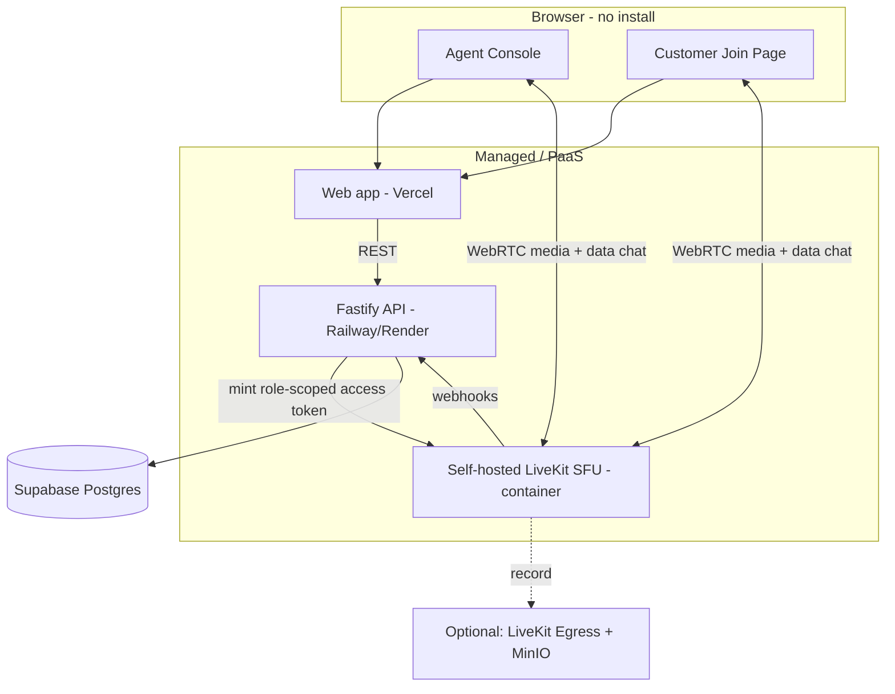
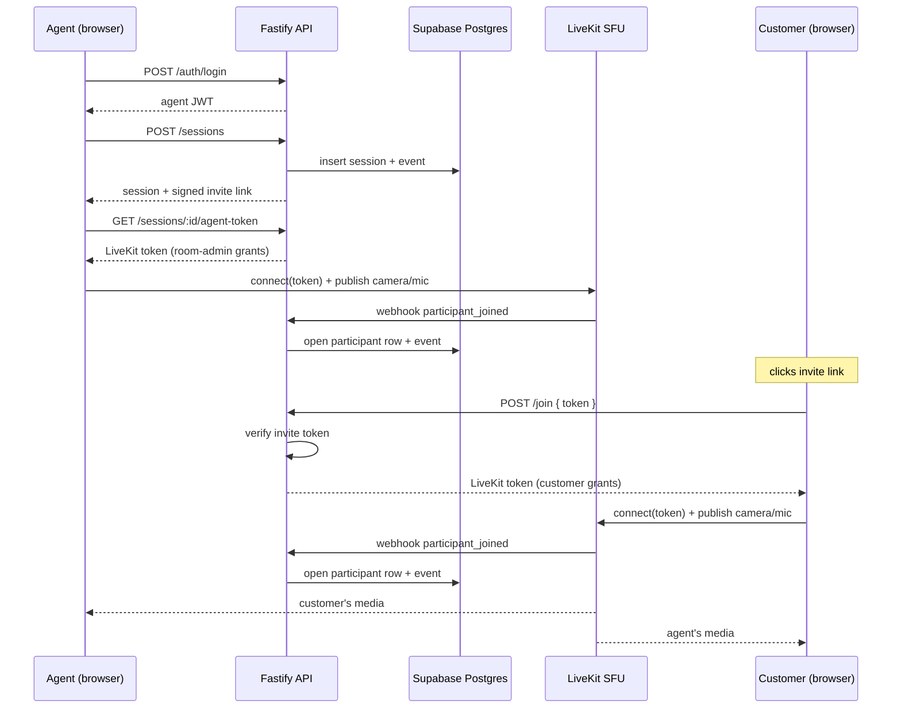
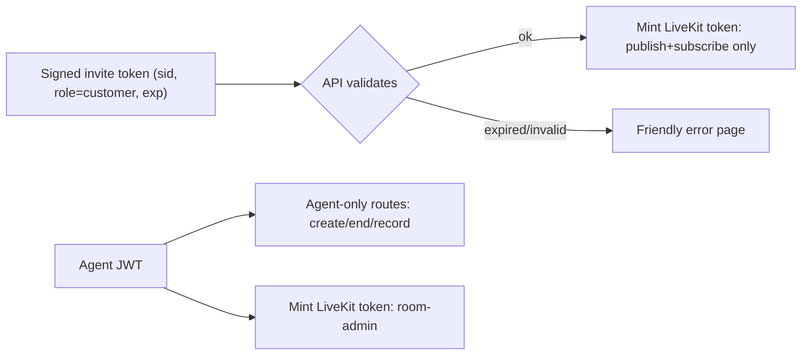

# AssistLens — Architecture & Design

## System overview

## Media routing (the key constraint)

The spec bans direct peer-to-peer and bans third-party hosted video APIs. AssistLens uses a **self-hosted LiveKit SFU**: every participant publishes their stream to a LiveKit server we run in our own container, and the server forwards streams to the other participants. Media never flows browser-to-browser, and it never touches a hosted video vendor. LiveKit Cloud is deliberately not used so the "owned and operated entirely by you" claim is unambiguous.

## Sequence: agent creates → customer joins

## Data model (Postgres)

- **agents** — `id, email, password_hash`
- **sessions** — `id, agent_id, room_name, title, status, created_at, ended_at, ended_by`
- **participants** — `id, session_id, role, identity, display_name, joined_at, left_at, grace_until`
  - `left_at IS NULL` ⇒ currently present (this is our presence source of truth)
  - `grace_until` ⇒ reconnect grace timer
  - partial unique index on `(session_id, identity) WHERE left_at IS NULL` ⇒ at most one open row per identity
- **events** — `id, session_id, type, identity, metadata, created_at` (the event log: joined / reconnected / disconnected / duplicate_join / left / recording_*)
- **chat_messages** — `id, session_id, sender_identity, sender_role, sender_name, body, created_at`
- **recordings** — `id, session_id, egress_id, status, object_key, created_at, updated_at`

## Access control

The invite token is the single access-control primitive for customers:

- Agent-only API routes require a valid agent JWT (and ownership of the session).
- Chat persistence accepts either an agent JWT or a customer invite token, scoped to the session.
- LiveKit grants enforce roles at the media layer (customers cannot close/manage the room).

## Reliability mechanisms

- **Server-authoritative state** via LiveKit webhooks — participant lifecycle is recorded from `participant_joined` / `participant_left` / `room_finished` rather than trusting the client.
- **Reconnect grace** — `participant_left` stamps `left_at` and `grace_until = now() + RECONNECT_GRACE_SECONDS`. A rejoin within that window re-opens the same row (no churn, others not notified). A 5-second sweep finalizes expired windows into a `left` event.
- **Duplicate join** — an existing open row for the same identity is detected at join time and logged.
- **Clean teardown** — ending a session deletes the LiveKit room (closing all connections), marks the session ended, and closes all open participant rows.

## Observability

`/api/metrics` (Prometheus text format) exposes:

- `assistlens_active_sessions`
- `assistlens_connected_participants`
- `assistlens_errors_total{route}`
- default Node process metrics

LiveKit exposes its own metrics on its `prometheus_port`. Scrape config: [`../infra/prometheus.yml`](../infra/prometheus.yml).
