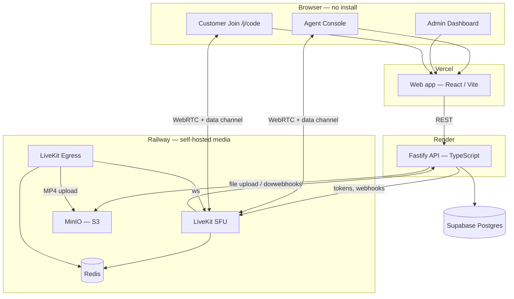
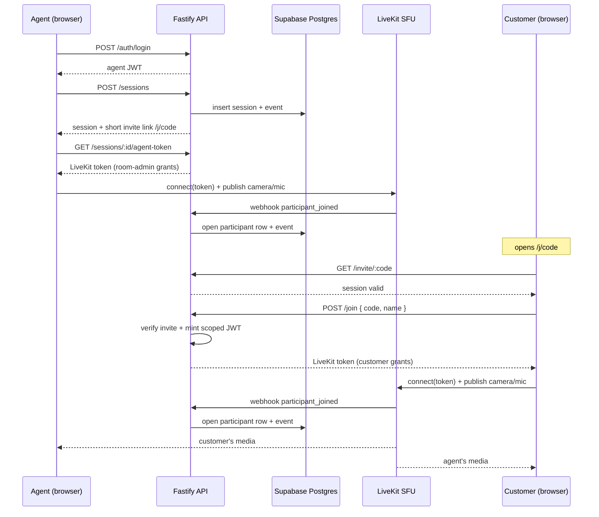
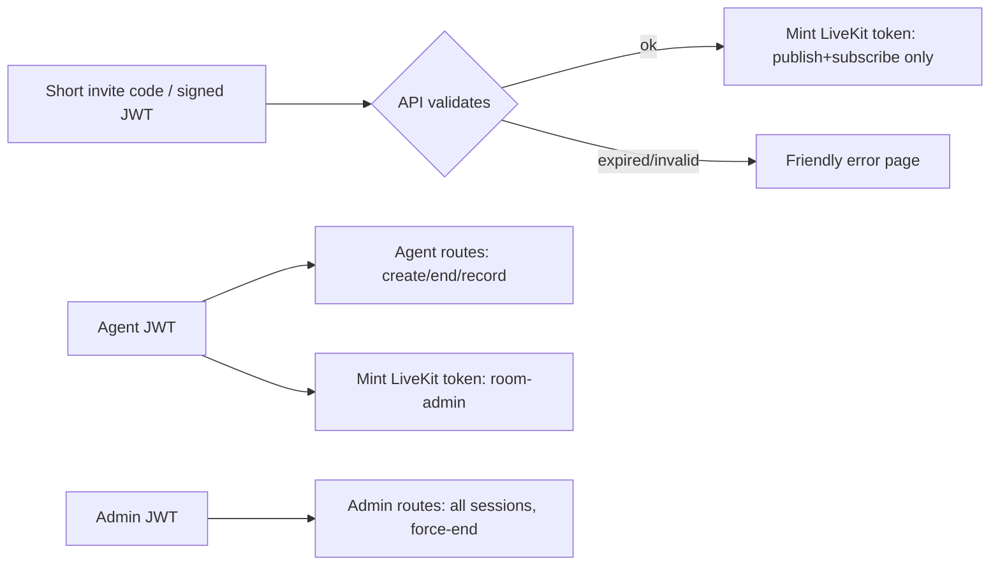

# AssistLens — Architecture & Design

## System overview

## Media routing (the key constraint)

The spec bans direct peer-to-peer and bans third-party hosted video APIs. AssistLens uses a **self-hosted LiveKit SFU**: every participant publishes their stream to a LiveKit server we run in our own container, and the server forwards streams to the other participants. Media never flows browser-to-browser, and it never touches a hosted video vendor. LiveKit Cloud is deliberately not used.

## Production deployment

| Layer | Service | Role |
| --- | --- | --- |
| Frontend | Vercel | Static React SPA; `VITE_API_BASE` points to Render API |
| API | Render | Auth, sessions, join, chat, files, webhooks, admin, metrics |
| Database | Supabase Postgres | Sessions, participants, events, chat, recordings metadata |
| Media | Railway — LiveKit SFU | WebRTC routing; public `wss://` + TCP proxy on port 7882 |
| Storage | Railway — MinIO | Chat file attachments and recording MP4s |
| Recording | Railway — Redis + Egress | Room composite recording to MinIO |

Full Railway setup: [`../infra/railway/README.md`](../infra/railway/README.md).

## Sequence: agent creates → customer joins

## Data model (Postgres)

- **agents** — `id, email, password_hash, is_admin`
- **sessions** — `id, agent_id, room_name, title, status, invite_code, created_at, ended_at, ended_by`
- **participants** — `id, session_id, role, identity, display_name, joined_at, left_at, grace_until`
  - `left_at IS NULL` ⇒ currently present (presence source of truth)
  - `grace_until` ⇒ reconnect grace timer
  - partial unique index on `(session_id, identity) WHERE left_at IS NULL` ⇒ at most one open row per identity
- **events** — `id, session_id, type, identity, metadata, created_at` (joined / reconnected / disconnected / duplicate_join / left / recording_*)
- **chat_messages** — `id, session_id, sender_identity, sender_role, sender_name, body, created_at`
- **recordings** — `id, session_id, egress_id, status, object_key, created_at, updated_at`
- **chat_files** — `id, session_id, uploader_identity, file_name, mime_type, object_key, created_at`

## Access control

- **Agent** routes require a valid agent JWT and session ownership.
- **Admin** routes require a separate admin JWT; admins see all sessions but cannot use agent-only ownership checks.
- **Customer** access is via short invite code at join time; scoped invite JWT is minted for chat/files.
- **LiveKit grants** enforce roles at the media layer (customers cannot close or manage the room).

## Reliability mechanisms

- **Server-authoritative state** via LiveKit webhooks — participant lifecycle is recorded from `participant_joined` / `participant_left` / `room_finished` rather than trusting the client.
- **Reconnect grace** — `participant_left` stamps `left_at` and `grace_until = now() + RECONNECT_GRACE_SECONDS`. A rejoin within that window re-opens the same row. A 5-second sweep finalizes expired windows into a `left` event.
- **Duplicate join** — an existing open row for the same identity is detected at join time, logged as `duplicate_join`, and surfaced to the customer UI.
- **Clean teardown** — ending a session deletes the LiveKit room, marks the session ended, and closes all open participant rows.
- **Recording reconcile** — a background sweep fixes recordings stuck in `processing` / `in_progress` by checking LiveKit Egress and S3.

## Observability

`/api/health` — liveness check for Render.

`/api/metrics` (Prometheus text format) exposes:

- `assistlens_active_sessions`
- `assistlens_connected_participants`
- `assistlens_errors_total{route}`
- default Node process metrics

LiveKit exposes its own metrics on its `prometheus_port`. Scrape config: [`../infra/prometheus.yml`](../infra/prometheus.yml).
